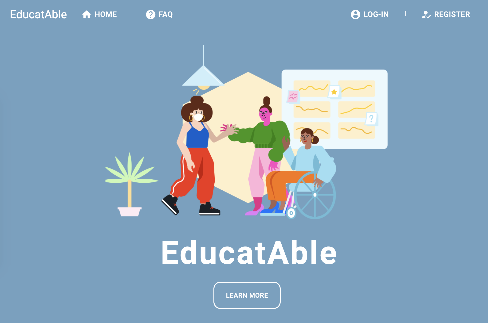

# EducatAble
EducatAble is a safe space to ask questions and learn information from people who live their different abilities everyday.

[Link to Page](https://educatable.herokuapp.com/)

## Description
EducatAble is an application that allows opportunities for individuals who are differently abled or fully-abled to understand more about a community that they may not know about. It can be hard to start the conversation and feel comfortable asking certain questions. This app will allow you to understand a perspective different to your normal. EducatAble's goal is to educate those who are willing to learn in a bite-sized approach with a platform for users to register and ask a question about a disability, get random tips, and eventually sign up for a tips-a-day through email.

## How to use
Browse the FAQs and learn things! If you have a question that isn't answered, create and account and you can submit a new question to be answered by someone in the community.

## Tech used
- Visual Studios
- JavaScript
- TypeScript
- Node.js
- Express
- React
- Material UI
- MongoDB
- Heroku
- axios
- bcrypt
- JSON web token
- Mongoose
- Webpack

## Development Team
Viviana - Front-end
Claire - Front-end and Backend
Travis - Back-end
Reeka - Back-end and Project Manager

## App Future
EducatAble's goal is to eventually sign up for a tips-a-day through email and expand to include additional communties (differently abled as well as others).

https://educatable.herokuapp.com/